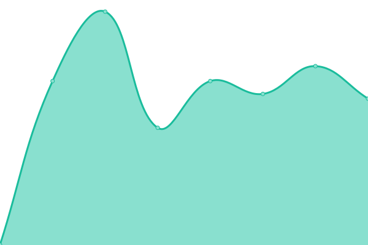

# [📈 Live Status](https://demo.upptime.js.org): <!--live status--> **🟧 Partial outage**

ja-m
This repository contains the open-source uptime monitor and status page for [Upptime](https://upptime.js.org), powered by [Upptime](https://github.com/upptime/upptime).

With [Upptime](https://upptime.js.org), you can get your own unlimited and free uptime monitor and status page, powered entirely by a GitHub repository. We use [Issues](https://github.com/upptime/upptime/issues) as incident reports, [Actions](https://github.com/ja-m/Mader-Monitoring/actions) as uptime monitors, and [Pages](https://demo.upptime.js.org) for the status page.

<!--start: status pages-->
<!-- This summary is generated by Upptime (https://github.com/upptime/upptime) -->
<!-- Do not edit this manually, your changes will be overwritten -->
<!-- prettier-ignore -->
| URL | Status | History | Response Time | Uptime |
| --- | ------ | ------- | ------------- | ------ |
|  JaKeJu Calibre-Web | 🟩 Up | [ja-ke-ju-calibre-web.yml](https://github.com/ja-m/Mader-Monitoring/commits/HEAD/history/ja-ke-ju-calibre-web.yml) | 

 2000ms
     
 | 

<a href="https://ja-m.github.io/Mader-Monitoring/history/ja-ke-ju-calibre-web">99.47%</a>
    

|  JaKeJu Calibre-Web (direct) | 🟩 Up | [ja-ke-ju-calibre-web-direct.yml](https://github.com/ja-m/Mader-Monitoring/commits/HEAD/history/ja-ke-ju-calibre-web-direct.yml) | 

 676ms
     
 | 

<a href="https://ja-m.github.io/Mader-Monitoring/history/ja-ke-ju-calibre-web-direct">100.00%</a>
    

|  [jan-mader.de](http://jan-mader.de) | 🟩 Up | [jan-mader-de.yml](https://github.com/ja-m/Mader-Monitoring/commits/HEAD/history/jan-mader-de.yml) | 

 738ms
     
 | 

<a href="https://ja-m.github.io/Mader-Monitoring/history/jan-mader-de">100.00%</a>
    

|  [jule-mader.de](https://jule-mader.de) | 🟩 Up | [jule-mader-de.yml](https://github.com/ja-m/Mader-Monitoring/commits/HEAD/history/jule-mader-de.yml) | 

 546ms
     
 | 

<a href="https://ja-m.github.io/Mader-Monitoring/history/jule-mader-de">100.00%</a>
    

|  [ServiceNow PDI](https://dev79194.service-now.com) | 🟥 Down | [service-now-pdi.yml](https://github.com/ja-m/Mader-Monitoring/commits/HEAD/history/service-now-pdi.yml) | 

 344ms
     
 | 

<a href="https://ja-m.github.io/Mader-Monitoring/history/service-now-pdi">73.98%</a>
    

<!--end: status pages-->

[**Visit our status website →**](https://demo.upptime.js.org)

## 📄 License

- Powered by: [Upptime](https://github.com/upptime/upptime)
- Code: [MIT](./LICENSE) © [Upptime](https://upptime.js.org)
- Data in the `./history` directory: [Open Database License](https://opendatacommons.org/licenses/odbl/1-0/)
